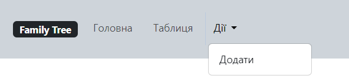

## Тема: 
### Спроєктувати та реалізувати бібліотеку класів для розробки родового (Генеалогічного) дерева. Паспортні дані членів деякого родового клану; посилання на дітей (або на батьків). Пошук всіх нащадків або всіх предків для вказаної особи. Ієрархічне відображення генеалогічного дерева обраної людини.
## Виконала:
### Мар'яна Васильєва

## Загальні теоретичні основи:
#### 1. Локальний сервер розробки - це середовище для розробки вебдодатків на локальному комп'ютері. Локальний сервер дозволяє запускати вебсервер, базу даних, та інші сервіси для розробки та тестування вебдодатків. Локальний сервер дозволяє розробникам працювати над вебдодатками без доступу до Інтернету та забезпечує швидкий доступ до ресурсів.
#### 2. Модель-контролер-представлення (MVC) - це архітектурний шаблон для розробки вебдодатків, який розділяє логіку програми на три компоненти: модель, контролер, та представлення. Модель відповідає за роботу з даними, контролер відповідає за обробку запитів, та представлення відповідає за відображення даних. MVC дозволяє розділити логіку програми на окремі компоненти та забезпечує гнучкість та розширюваність програми.
#### 3. SQL - це мова запитів для роботи з базами даних, яка використовується для зберігання та обробки даних. SQL дозволяє створювати таблиці, вставляти, оновлювати, видаляти дані, та виконувати запити до бази даних. SQL підтримує різні типи даних, операції, та функції для роботи з даними.
#### 4. Таблиця - це структура для зберігання даних у базі даних, яка складається з рядків та стовпців. Кожен рядок таблиці представляє запис з даними, а кожен стовпець представляє властивість запису. Таблиці можуть бути пов'язані між собою за допомогою зовнішніх ключів, що дозволяє створювати зв'язки між даними.
#### 5. Запит - це команда для виконання операцій з базою даних, яка використовується для отримання, вставки, оновлення, видалення даних. Запити можуть бути виконані за допомогою SQL-команд, які виконують операції з базою даних. Запити можуть бути використані для отримання даних з бази даних, вставки нових даних, оновлення наявних даних, та видалення даних.
#### 6. Генеалогічне дерево - це ієрархічна структура, що відображає зв'язки між членами сім'ї. Кожна особа може мати батьків, дітей, та інших родичів. Генеалогічне дерево може бути представлене у вигляді графа, де вершини - це особи, а ребра - це зв'язки між ними. Генеалогічне дерево може бути використане для відстеження родоводу, пошуку нащадків/предків, та відображення зв'язків між членами сім'ї.
#### 7. Мова програмування PHP - це мова програмування загального призначення, яка використовується для розробки вебдодатків. PHP підтримує об'єктноорієнтоване програмування, що дозволяє створювати класи та об'єкти для роботи з даними. PHP також підтримує роботу з базами даних, що дозволяє зберігати та обробляти інформацію.
#### 8. СУБД SQLite - це легка вбудовувана база даних, яка підтримує стандарт SQL. SQLite зберігає дані у вигляді файлів на диску, що дозволяє легко переносити та резервувати дані. SQLite підтримує транзакції, індекси, та інші функції для роботи з даними.
#### 9. Composer - це пакетний менеджер для PHP, який дозволяє встановлювати та оновлювати залежності для проєктів. Composer дозволяє встановлювати пакети з Packagist, а також власні пакети. Composer автоматизує процес встановлення та оновлення залежностей, що дозволяє зосередитися на розробці програми.
#### 10. Пакет "nikic/fast-route" - це бібліотека для маршрутизації HTTP-запитів у PHP. FastRoute дозволяє визначати маршрути для обробки запитів, що дозволяє створювати вебдодатки з різними сторінками та функціоналом. FastRoute підтримує шаблони маршрутів, що дозволяє визначати динамічні маршрути для обробки запитів.
#### 11. Blade - це шаблонізатор для PHP, який дозволяє використовувати шаблони для відображення даних. Blade дозволяє використовувати директиви, які замінюються на значення змінних, що дозволяє створювати шаблони для відображення даних. Blade підтримує вкладені шаблони, що дозволяє створювати складні структури для відображення даних.
#### 12. HTML - це мова розмітки для створення вебсторінок та додатків. HTML використовує теги для визначення структури сторінки, що дозволяє відображати текст, зображення, та інші елементи. HTML підтримує вкладені теги, атрибути, та інші функції для створення вебсторінок.
#### 13. CSS - це мова стилів для оформлення вебсторінок та додатків. CSS використовує правила для визначення стилів елементів, що дозволяє змінювати кольори, шрифти, розміри, та інші властивості. CSS підтримує класи, ідентифікатори, та інші селектори для вибору елементів для оформлення.
#### 14. Bootstrap - це фреймворк для розробки вебсторінок та додатків. Bootstrap містить готові компоненти, які дозволяють швидко створювати стильні та адаптивні вебсторінки. Bootstrap підтримує сітку, кнопки, форми, та інші елементи для розробки вебсторінок.
#### 15. Google Icons - це набір іконок для вебсторінок та додатків. Google Icons містить різноманітні іконки, які можна використовувати для відображення різних елементів на сторінці. Google Icons підтримує різні розміри та стилі іконок, що дозволяє вибрати необхідний варіант для вебсторінки.
  
## Теоретичні основи ООП та їх використання:
#### 1. Інкапсуляція - це принцип ООП, який дозволяє об'єднувати дані та методи в класах. Інкапсуляція дозволяє приховувати деталі реалізації та забезпечувати доступ до даних через методи. Це дозволяє зменшити залежність між класами та забезпечити безпеку даних.
#### 2. Наслідування - це принцип ООП, який дозволяє створювати нові класи на основі наявних класів. Наслідування дозволяє використовувати властивості та методи батьківського класу у дочірньому класі. Це дозволяє зменшити дублювання коду та забезпечити повторне використання коду.
#### 3. Поліморфізм - це принцип ООП, який дозволяє використовувати об'єкти різних класів через спільний інтерфейс. Поліморфізм дозволяє використовувати об'єкти різних класів у ролі аргументів методів та повертати різні типи об'єктів. Це дозволяє зменшити залежність від конкретних класів та забезпечити гнучкість програми.
#### 4. Клас - це шаблон для створення об'єктів, який містить властивості та методи для роботи з даними. Клас може мати конструктор для ініціалізації об'єкта, властивості для зберігання даних, та методи для роботи з даними. Клас може бути використаний для створення об'єктів, які представляють реальні об'єкти або концепції.
#### 5. Об'єкт - це екземпляр класу, який містить дані та методи для роботи з даними. Об'єкт може мати властивості для зберігання даних та методи для роботи з даними. Об'єкт може бути створений за допомогою конструктора класу та використаний для виконання операцій над даними.
#### 6. Метод - це функція, яка визначена в класі та використовується для роботи з даними. Метод може приймати аргументи, виконувати операції над даними, та повертати результати. Метод може бути викликаний для об'єкта класу та використаний для виконання певних операцій.
#### 7. Властивість - це змінна, яка визначена в класі та використовується для зберігання даних. Властивість може бути публічною, приватною, або захищеною, що визначає доступ до даних ззовні класу. Властивість може бути використана для зберігання даних та передачі їх між методами класу.
#### 8. Конструктор - це спеціальний метод класу, який викликається при створенні нового об'єкта. Конструктор може приймати аргументи для ініціалізації об'єкта та виконувати певні операції. Конструктор може бути використаний для ініціалізації властивостей об'єкта та виконання певних дій при створенні об'єкта.
#### 9. Статичний метод - це метод класу, який може бути викликаний без створення об'єкта. Статичний метод може бути використаний для виконання операцій, які не потребують доступу до властивостей об'єкта. Статичний метод може бути викликаний через ім'я класу та використаний для виконання певних операцій.
#### 10. Статична властивість - це властивість класу, яка може бути викликана без створення об'єкта. Статична властивість може бути використана для зберігання даних, які не залежать від конкретного об'єкта. Статична властивість може бути викликана через ім'я класу та використана для зберігання даних.
#### 11. Абстрактний клас - це клас, який містить абстрактні методи та може бути використаний для створення інших класів. Абстрактний клас може містити абстрактні методи, які повинні бути реалізовані в дочірніх класах. Абстрактний клас може бути використаний для визначення загальних властивостей та методів для дочірніх класів.
#### 12. Інтерфейс - це контракт, який визначає методи, які повинні бути реалізовані в класі. Інтерфейс може містити декларації методів без їх реалізації, що дозволяє визначити структуру класу. Інтерфейс може бути використаний для визначення методів, які повинні бути реалізовані в класі, що дозволяє створювати класи з однаковим інтерфейсом.
#### 13. Трейт - це механізм для повторного використання коду в PHP, який дозволяє додавати методи та властивості до класу. Трейт може містити методи та властивості, які можуть бути використані в класі. Трейт може бути використаний для додавання функціональності до класу без наслідування.
#### 14. Константа - це змінна, яка має постійне значення та не може бути змінена під час виконання програми. Константа може бути визначена в класі та використана для зберігання значень, які не змінюються. Константа може бути використана для зберігання значень, які використовуються в різних частинах програми.
#### 15. Простори імен - це механізм для організації класів та функцій в PHP, який дозволяє уникнути конфліктів імен. Простір імен може містити класи, функції, та константи, які можуть бути використані в програмі. Простір імен може бути використаний для організації коду та уникнення конфліктів імен.
#### 16. Автозавантаження класів - це механізм для автоматичного завантаження класів в PHP, який дозволяє використовувати класи без ручного підключення файлів. Автозавантаження класів може бути використане для автоматичного завантаження класів з файлів за допомогою функцій автозавантаження. Автозавантаження класів дозволяє зосередитися на розробці програми та уникнути дублювання коду.
#### 17. Патерни проєктування - це шаблони для розробки програмного забезпечення, які дозволяють розв'язувати типові проблеми та завдання. Патерни проєктування дозволяють створювати програми, які є гнучкими, розширюваними, та підтримуваними. Патерни проєктування дозволяють використовувати best practices та забезпечують високу якість програмного забезпечення.
#### 18. Singleton - це патерн проєктування, який використовується для створення єдиного екземпляра класу. Singleton дозволяє створити тільки один об'єкт класу та забезпечує глобальний доступ до нього. Singleton може бути використаний для створення єдиного об'єкта, який може бути використаний в різних частинах програми.
#### 19. Factory - це патерн проєктування, який використовується для створення об'єктів без прив'язки до конкретних класів. Factory дозволяє створювати об'єкти за допомогою фабричних методів та фабричних класів. Factory може бути використаний для створення об'єктів залежно від умов та параметрів.

## Опис проєкту:
### 1. Формулювання вимог
#### а) Функції додатка
- Зберігання інформації: Збереження даних про членів сім'ї (ім'я, дата народження тощо).
- Посилання на родичів: Відстеження зв'язків між членами сім'ї (батьки, діти).
- Пошук нащадків/предків: Можливість пошуку всіх нащадків або предків для вказаної особи.
- Відображення дерева: Генерація генеалогічного дерева в ієрархічному форматі.

- 

#### б) Інтерфейс користувача
- Простий UI: Інтерфейс, який дозволяє легко додавати, редагувати, та переглядати дані.

  

- Графічне представлення дерева: Візуальне представлення зв'язків між особами.
#### в) Технічні вимоги
- Мова програмування: PHP 8.3
- СУБД: SQLite
- Пакетний менеджер: Composer
- Веб-сервер: Локальний сервер (PHP built-in server)
- Маршрутизація: nikic/fast-route
- Шаблонізатор: Blade 
- Frontend: HTML, CSS, Bootstrap, Google Icons
- Наповнення тестовими даними: пакет Faker
### 2. Аналіз і проєктування
#### а) Аналіз
- Створення класу: "Person" для представлення особи та її властивостей.
- Визначення атрибутів: Ім'я, дата народження, стать тощо.
- Створення методів: Додавання, редагування, видалення, пошук нащадків/предків.
- Створення класу Tree: Для генерації генеалогічного дерева.
- Відображення дерева: Генерація генеалогічного дерева в ієрархічному форматі за допомогою SQL-запитів та колекцій об'єктів.
- Візуальне представлення: Відображення дерева у вигляді блоків зі зв'язками.
#### б) Проєктування
- Структура бази даних: Таблиця "People" з полями "id", "first_name", "last_name", "birth_date", "mother_id", "father_id".
```sql
CREATE TABLE IF NOT EXISTS people (
  id INTEGER PRIMARY KEY AUTOINCREMENT NOT NULL,
  first_name TEXT NOT NULL,
  last_name TEXT NOT NULL,
  gender TEXT NOT NULL,
  birth_date DATE NOT NULL,
  death_date DATE DEFAULT NULL,
  father_id INTEGER DEFAULT NULL,
  mother_id INTEGER DEFAULT NULL,
  FOREIGN KEY (father_id) REFERENCES people(id),
  FOREIGN KEY (mother_id) REFERENCES people(id),
  CHECK (death_date > birth_date),
  CHECK (death_date IS NULL OR death_date > birth_date),
  CHECK (father_id != mother_id AND mother_id != id AND father_id != id)
)
```
- Архітектура додатку: Модель-контролер-представлення (MVC).
- Візуальне представлення: Відображення дерева у вигляді блоків зі зв'язками.
### 3. Реалізація
#### а) База даних
- Створення таблиці "People" - посилання на рядок в коді: [index.php](https://github.com/Maryana232/family_tree/blob/a762eab343159a5b59c6449ca29f16381007f850/public/index.php#L25).
- Побудова SQL-запитів для додавання, редагування, видалення, пошуку нащадків/предків.
#### б) Логіка програми
- Реалізація класу "Person" для представлення особи та її властивостей, методів: [Person.php](https://github.com/Maryana232/family_tree/blob/master/src/Person.php)
- Реалізація контролерів для додавання, редагування, видалення, та відображення даних.
- Реалізація представлень для відображення дерева та інших даних.
- Реалізація класу "Tree" для генерації генеалогічного дерева: [Tree.php](https://github.com/Maryana232/family_tree/blob/master/src/Tree.php)
#### в) Візуальне представлення
- Реалізація вебінтерфейсу для взаємодії з користувачем: [add_person.blade.php](https://github.com/Maryana232/family_tree/blob/master/views/pages/add_person.blade.php
- Реалізація візуального представлення дерева: [person.blade.php](https://github.com/Maryana232/family_tree/blob/master/views/pages/person.blade.php)
### 4. Встановлення та тестування
#### а) Встановлення:
- Клонування репозиторію:
  ```bash
  git clone https://github.com/Maryana232/family_tree.git
  ```
- Встановлення залежностей:
  ```bash
  composer install
  ```
- Запуск локального сервера:
  ```bash
  php -S localhost:8000 -t public
  ```
#### b) Консольні команди
- Вивести дерево для конкретної особи:
  ```bash
  php console.php show-person 7
  ```
- Вивести всіх предків для конкретної особи:
  ```bash
  php console.php show-ancestors 6
  ```
- Вивести всіх нащадків для конкретної особи:
  ```bash
  php console.php show-descendants 12
  ```
#### б) Тестування бази даних
- Перевірка збереження та відображення даних.
- Перевірка зв'язків між членами сім'ї.
#### в) Тестування логіки програми
- Перевірка додавання, редагування, видалення, та відображення даних.
- Перевірка відображення дерева.
#### г) Тестування візуального представлення
- Перевірка відображення вебінтерфейсу.
- Перевірка відображення дерева.
