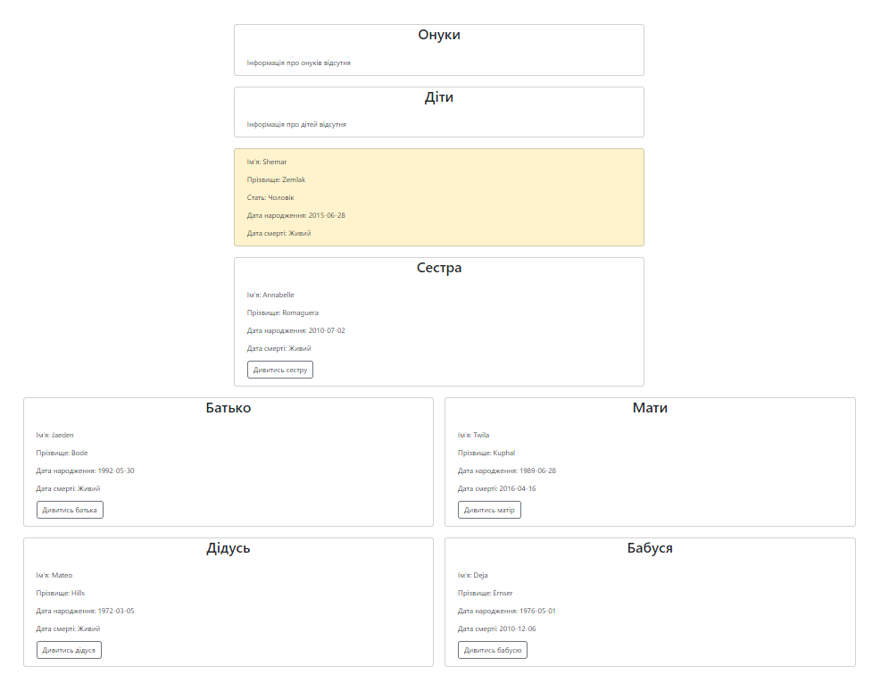

## Тема: 
### Спроектувати та реалізувати бібліотеку класів для розробки родового (Генеалогічного) дерева. Паспортні дані членів деякого родового клану; посилання на дітей (або на батьків). Пошук всіх нащадків або всіх предків для вказаної особи. Ієрархічне відображення генеалогічного дерева обраної людини.
## Виконала:
### Мар'яна Васильєва
## Опис проєкту:
### 1. Формулювання вимог
#### а) Функції додатку
- Зберігання інформації: Збереження даних про членів сім'ї (ім'я, дата народження тощо).
- Посилання на родичів: Відстеження зв'язків між членами сім'ї (батьки, діти).
- Пошук нащадків/предків: Можливість пошуку всіх нащадків або предків для вказаної особи.
- Відображення дерева: Генерація генеалогічного дерева в ієрархічному форматі.

- 

#### б) Інтерфейс користувача
- Простий UI: Інтерфейс, який дозволяє легко додавати, редагувати, та переглядати дані.

  

- Графічне представлення дерева: Візуальне представлення зв'язків між особами.
#### в) Технічні вимоги
- Мова програмування: PHP 8.3
- СУБД: SQLite
- Пакетний менеджер: Composer
- Веб-сервер: Локальний сервер (PHP built-in server)
- Маршрутизація: nikic/fast-route
- Шаблонізатор: Blade 
- Фронтенд: HTML, CSS, Bootstrap, Google Icons
- Наповнення тестовими даними: Faker
### 2. Аналіз і проектування
#### а) Аналіз
- Створення класу: "Person" для представлення особи та її властивостей.
- Визначення атрибутів: Ім'я, дата народження, стать тощо.
- Створення методів: Додавання, редагування, видалення, пошук нащадків/предків.
- Створення класу Tree: Для генерації генеалогічного дерева.
- Відображення дерева: Генерація генеалогічного дерева в ієрархічному форматі за допомогою SQL-запитів та колекцій об'єктів.
- Візуальне представлення: Відображення дерева у вигляді блоків зі зв'язками.
#### б) Проектування
- Структура бази даних: Таблиця "People" з полями "id", "first_name", "last_name", "birth_date", "mother_id", "father_id".
```sql
CREATE TABLE IF NOT EXISTS people (
  id INTEGER PRIMARY KEY AUTOINCREMENT NOT NULL,
  first_name TEXT NOT NULL,
  last_name TEXT NOT NULL,
  gender TEXT NOT NULL,
  birth_date DATE NOT NULL,
  death_date DATE DEFAULT NULL,
  father_id INTEGER DEFAULT NULL,
  mother_id INTEGER DEFAULT NULL,
  FOREIGN KEY (father_id) REFERENCES people(id),
  FOREIGN KEY (mother_id) REFERENCES people(id),
  CHECK (death_date > birth_date),
  CHECK (death_date IS NULL OR death_date > birth_date),
  CHECK (father_id != mother_id AND mother_id != id AND father_id != id)
)
```
- Архітектура додатку: Модель-контролер-представлення (MVC).
- Візуальне представлення: Відображення дерева у вигляді блоків зі зв'язками.
### 3. Реалізація
#### а) База даних
- Створення таблиці "People" - посилання на рядок в коді: [index.php](https://github.com/Maryana232/family_tree/blob/a762eab343159a5b59c6449ca29f16381007f850/public/index.php#L25).
- Побудова SQL-запитів для додавання, редагування, видалення, пошуку нащадків/предків.
#### б) Логіка програми
- Реалізація класу "Person" для представлення особи та її властивостей, методів: [Person.php](https://github.com/Maryana232/family_tree/blob/master/src/Person.php)
- Реалізація контролерів для додавання, редагування, видалення, та відображення даних.
- Реалізація представлень для відображення дерева та інших даних.
- Реалізація класу "Tree" для генерації генеалогічного дерева: [Tree.php](
#### в) Візуальне представлення
- Реалізація веб-інтерфейсу для взаємодії з користувачем: [add_person.blade.php](https://github.com/Maryana232/family_tree/blob/master/views/pages/add_person.blade.php
- Реалізація візуального представлення дерева: [person.blade.php](https://github.com/Maryana232/family_tree/blob/master/views/pages/person.blade.php)
### 4. Встановлення та тестування
#### а) Встановлення:
1. Клонування репозиторію:
```bash
git clone https://github.com/Maryana232/family_tree.git
```
2. Встановлення залежностей:
```bash
composer install
```
3. Запуск локального сервера:
```bash
php -S localhost:8000 -t public
```
#### a) Консольні команди
- Вивести дерево для конкретної особи:
```bash
php console.php show-person 7
```
- Вивести всіх предків для конкретної особи:
```bash
php console.php show-ancestors 6
```
- Вивести всіх нащадків для конкретної особи:
```bash
php console.php show-descendants 12
```
```bash
#### б) Тестування бази даних
- Перевірка збереження та відображення даних.
- Перевірка зв'язків між членами сім'ї.
#### в) Тестування логіки програми
- Перевірка додавання, редагування, видалення, та відображення даних.
- Перевірка відображення дерева.
#### г) Тестування візуального представлення
- Перевірка відображення веб-інтерфейсу.
- Перевірка відображення дерева.
